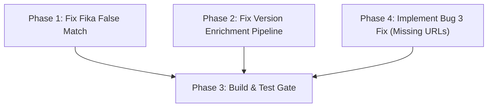

# Restore Lost Functionality — Phased Multi-Agent Plan

## Problem Summary

Three bugs were identified by comparing our output to the original. All features exist in the codebase but aren't executing correctly. This plan fixes them in dependency order with isolated, verifiable phases.

---

## Dependency Graph



Phases 1, 2, and 4 are **independent** — they touch different areas and can run in parallel via separate agents. Phase 3 is the combined verification gate.

---

## Phase 1 — Fix Fika False Match (Agent A)

> **Goal:** Remove `"core"` from the suffix strip list so `"Fika.Core"` stops falsely matching `"Fika"`.  
> **Files touched:** `Utils/ModNameNormalizer.cs`, `Tests/CheckMods.Tests/ModReconciliationServiceTests.cs`  
> **Expected outcome:** 9 matched pairs (not 10), 54 total mods (not 53), "Project Fika - Server" reappears in dependency tree.

### Step 1.1 — Read and understand the normalizer
1. Edit `Utils/ModNameNormalizer.cs L9`:
   ```diff
   -public static readonly string[] SuffixesToRemove = ["server", "client", "plugin", "api", "core"];
   +public static readonly string[] SuffixesToRemove = ["server", "client", "plugin", "api"];
   ```

### Step 1.2 — Add regression test
1. Open `Tests/CheckMods.Tests/ModReconciliationServiceTests.cs`.
2. Add a new `[Fact]` test method named `Fika_server_and_client_are_not_falsely_paired` that:
   - Creates a server `Mod` with `LocalName = "Fika"`, `Guid = "Fika"`.
   - Creates a client `Mod` with `LocalName = "Fika.Core"`, `Guid = "com.fika.core"`.
   - Calls `ReconcileMods(serverMods, clientMods)`.
   - Asserts `result.ReconciledPairs.Count == 0` (no match).

---

## Phase 2 — Fix Version Enrichment Pipeline (Agent B)

> **Goal:** Make `EnrichModsWithVersionDataAsync` and `ApplyIgnoredUpdatesAsync` merge their results back into the `mods` list, so the version table, FIN banner, download links, and menu options actually display.  
> **Files touched:** `Services/ApplicationService.cs`  

### Step 2.1 — Fix `EnrichModsWithVersionDataAsync`
1. Capture the return value from `EnrichAllWithVersionDataAsync`.
2. Build a dictionary of enriched mods keyed by GUID.
3. Replace matching entries in the `mods` list.

### Step 2.2 — Fix `ApplyIgnoredUpdatesAsync`
1. Capture and merge the return value:
   ```diff
   -await updateOrchestrationService.ApplyIgnoredUpdatesAsync(mods, cancellationToken);
   +var modsWithIgnores = await updateOrchestrationService.ApplyIgnoredUpdatesAsync(mods, cancellationToken);
   +mods.Clear();
   +mods.AddRange(modsWithIgnores);
   ```

---

## Phase 4 — Fix Missing Report URLs (Agent C)

> **Goal:** Ensure "Please report" URLs are displayed for mods with loading warnings.
> **Files touched:** `Services/ApplicationService.cs`, `Services/ModResolutionService.cs`

### Step 4.1 — Fix Discarded Results in ApplicationService
1. Update `ApplicationService.ScanAndReconcileModsAsync` to capture the return values of URL fetching.
2. For `modsWithWarnings`:
   ```csharp
   if (modsWithWarnings.Count > 0)
   {
       modsWithWarnings = (await modResolutionService.FetchSourceCodeUrlsForModsAsync(modsWithWarnings, sptVersion, cancellationToken)).ToList();
   }
   ```
3. For `pairsWithNotes`: capture `updatedPairs` from `FetchSourceCodeUrlsForPairedModsAsync` and update the `result.ReconciledPairs`.

### Step 4.2 — Fix `NoCompatibleVersion` Fallback in ModResolutionService
1. In `ModResolutionService.ResolveAndFetchUrlAsync` and `ResolveAndFetchUrlForPairAsync`, handle the `T2` (NoCompatibleVersion) case from `GetModByGuidAsync`:
   ```csharp
   if (guidResult.TryPickT0(out var match, out _))
   {
       apiResult = match;
   }
   else if (guidResult.TryPickT2(out var noCompat, out _))
   {
       apiResult = noCompat.Mod;
   }
   ```

---

## Phase 3 — Combined Build & Test Gate

> **Goal:** Verify all agents' changes compile and pass together.  

1. Run `dotnet build CheckMods.slnx`.
2. Run `dotnet test CheckMods.slnx`.
3. Verify output looks correct and updates state files.
